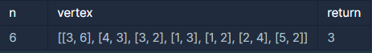
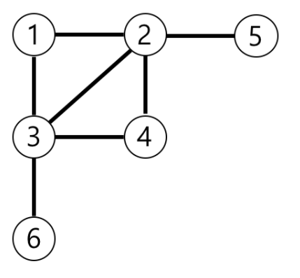

# Programmers_가장 먼 노드

### **문제 설명**

n개의 노드가 있는 그래프가 있습니다. 각 노드는 1부터 n까지 번호가 적혀있습니다. 1번 노드에서 가장 멀리 떨어진 노드의 갯수를 구하려고 합니다. 가장 멀리 떨어진 노드란 최단경로로 이동했을 때 간선의 개수가 가장 많은 노드들을 의미합니다.

노드의 개수 n, 간선에 대한 정보가 담긴 2차원 배열 vertex가 매개변수로 주어질 때, 1번 노드로부터 가장 멀리 떨어진 노드가 몇 개인지를 return 하도록 solution 함수를 작성해주세요.

### 제한사항

- 노드의 개수 n은 2 이상 20,000 이하입니다.
- 간선은 양방향이며 총 1개 이상 50,000개 이하의 간선이 있습니다.
- vertex 배열 각 행 [a, b]는 a번 노드와 b번 노드 사이에 간선이 있다는 의미입니다.

### 입출력 예



### 입출력 예 설명

예제의 그래프를 표현하면 아래 그림과 같고, 1번 노드에서 가장 멀리 떨어진 노드는 4,5,6번 노드입니다.



---

### 풀이

이 문제는 1번 노드에서 가장 먼 노드(최단 거리로 갔을 때 거쳐가는 노드 수가 최대가 되는 노드)의 수를 찾는 문제이다.

1번 노드를 시작으로 연결된 노드를 순회하면서 각 노드의 최단 거리를 구하면된다.

이 아이디어를 통해 BFS 알고리즘 문제라는 것을 알 수 있다.

문제 해결 과정은 아래와 같다.

1. 빈 해쉬, 리스트, 큐를 생성
    - 해쉬 : 그래프 정보를 저장하기 위해 사용된다.
    - 리스트 : 각 노드의 최단 거리 정보를 저장하기 위해서 사용된다.(또는 방문 여부를 체크 하기 위해 사용, 0 = 방문 X, 이외의 숫자 = 방문 O)
    - 큐 : BFS 알고리즘을 이용할 때 사용된다.

    ※이 문제에서는 시간 단축을 위해 그래프 정보를 인접행렬 형태가 아닌 해쉬에 저장하였다.

    추가로 아직 확실한 정보는 아니지만 상하좌우로 움직임이 필요한 문제는 인접행렬 그 이외의 경우는 해쉬에 그래프 정보를 저장하는 게 하나의 접근법일 거 같다. 

2. 생성한 해쉬에 그래프 정보를 저장
3. 생선한 큐에는 (이전 노드, 현재 노드, 거리) 형태의 튜플을 저장하며 반복문을 돌기 전

    (1, 1, 0)를 넣어준다.

    - (1, 1, 0)은 1번 노드에서 출발한다는 의미로 사용했다.
4. 반복문 내부는 현재 노드와 연결된 노드 들을 순회하며 방문하지 않은 노드(solution의 해당 노드 번호에 해당되는 값 == 0)이면 큐에 정보를 추가한다.
    - 코드

    ```python
    while my_que:
    				#이전 노드, 현재 노드, 거리
            prev, cur, distance =  my_que.popleft()
    				
    				#현재 노드와 연결된 노드를 탐색                        
            for dest in mat[cur]:
    						#현재 노드와 연결돼 있고 방문 전인 노드라면 True
                if solution[dest] == 0:
    								#현재까지의 가장 먼 노드보다 더 멀리 있는 노드가 발견된 경우 True
    								#answer을 다시 0으로 초기화하고 가장 먼 노드의 거리를 갱신한다.
                    if max_distance < distance+1:
                        max_distance = distance+1
                        answer = 0
                    
    								#노드의 방문 기록을 업데이트 한다.
                    solution[dest] = distance+1
    								
    								#큐에 새로운 정보를 추가한다.
    								#이때 정보는 (현재 노드, 현재 노드와 연결된 노드, 거리+1)이다.
    								#그 이후 answer를 1 증가시킨다.
                    my_que.append((cur, dest, distance+1))
                    answer += 1
    ```

**전체 코드**

```python
from collections import deque

def solution(n, edge):
    answer = 0
    mat = {}
    solution = [0]*(n+1)
    solution[1] = -1
    
    for v1, v2 in edge:
        mat[v1] = mat.get(v1, [])+[v2]
        mat[v2] = mat.get(v2, [])+[v1]
        
    my_que = deque([])
    
    my_que.append((1, 1, 0))
    max_distance = 0
    
    while my_que:
        prev, cur, distance =  my_que.popleft()
                        
        for dest in mat[cur]:
            if solution[dest] == 0:
                if max_distance < distance+1:
                    max_distance = distance+1
                    answer = 0
                    
                solution[dest] = distance+1
                my_que.append((cur, dest, distance+1))
                answer += 1
                
    return answer
```

---

### 출처

- 문제출처

    [https://programmers.co.kr/learn/courses/30/lessons/49189](https://programmers.co.kr/learn/courses/30/lessons/49189)