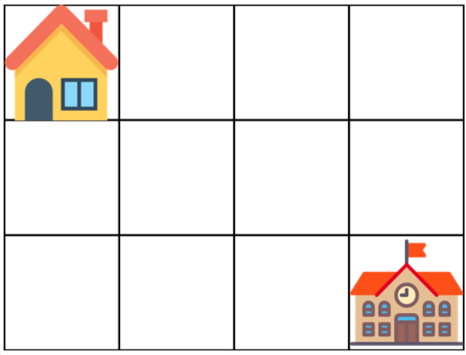
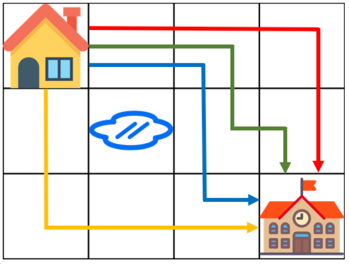

# Programmers_등굣길

### **문제 설명**

계속되는 폭우로 일부 지역이 물에 잠겼습니다. 물에 잠기지 않은 지역을 통해 학교를 가려고 합니다. 집에서 학교까지 가는 길은 m x n 크기의 격자모양으로 나타낼 수 있습니다.

아래 그림은 m = 4, n = 3 인 경우입니다.



가장 왼쪽 위, 즉 집이 있는 곳의 좌표는 (1, 1)로 나타내고 가장 오른쪽 아래, 즉 학교가 있는 곳의 좌표는 (m, n)으로 나타냅니다.

격자의 크기 m, n과 물이 잠긴 지역의 좌표를 담은 2차원 배열 puddles이 매개변수로 주어집니다. **오른쪽과 아래쪽으로만 움직여** 집에서 학교까지 갈 수 있는 최단경로의 개수를 1,000,000,007로 나눈 나머지를 return 하도록 solution 함수를 작성해주세요.

### 제한사항

- 격자의 크기 m, n은 1 이상 100 이하인 자연수입니다.
    - m과 n이 모두 1인 경우는 입력으로 주어지지 않습니다.
- 물에 잠긴 지역은 0개 이상 10개 이하입니다.
- 집과 학교가 물에 잠긴 경우는 입력으로 주어지지 않습니다.

### 입출력 예

m = 4, n = 3, puddles = [[2,2]] : return = 4

### 입출력 예 설명



---

### 풀이

이 문제는 최단 거리의 등굣길의 수를 구하는 문제이다.

칸을 이동하는 방향은 오른쪽 또는 아랫쪽이다.

⇒이 조건은 특정 칸으로 가는 거리가 최단거리임을 보장한다.

각 칸으로의 이동 방법의 수는 현재 칸을 기준으로 위쪽과 왼쪽 칸의 합을 통해 구할 수 있다.

⇒ 이 아이디어가 동적프로그래밍과 관련있어 보인다.

※이 때 위쪽과 왼쪽 칸은 물 웅덩이거나 좌표의 범위를 벗어나지 않아야 한다.

칸을 별로 이동 횟수를 구하기 위해서 BFS 알고리즘 아이디어를 이용했다.

먼저 이동할 칸을 저장할 큐를 만들고 하나씩 꺼내어 칸을 순회했다.

만약 현재 칸을 기준으로 오른쪽 또는 아랫쪽 칸이 처음 방문하는 칸이라면 큐에 저장했다.

이를 코드로 구현하면 아래와 같다.

```python
from collections import deque

def solution(m, n, puddles):
    answer = 0

    mat = [[0] * (m+1) for _ in range(n+1)]
    visited = [[False] * (m+1) for _ in range(n+1)]

    mat[1][1] = 1
    visited[1][1] = True

    for x,y in puddles :
        mat[y][x] = -1

    pos_list = deque()
    pos_list.append((1,1))

    while(pos_list):
        x, y = pos_list.popleft()

        #m+1 체크
        if(x < m and mat[y][x+1] != -1):
            mat[y][x+1] = (mat[y][x+1] + mat[y][x]) % 1000000007
            if(visited[y][x+1] == False):
                visited[y][x+1] = True
                pos_list.append((x+1, y))

        #n+1 체크
        if(y < n and mat[y+1][x] != -1):
            mat[y+1][x] = (mat[y+1][x] + mat[y][x]) % 1000000007
            if(visited[y+1][x] == False):
                visited[y+1][x] = True
                pos_list.append((x, y+1))

    answer = mat[n][m]

    return answer
```

---

### 출처

- 문제 출처

    [https://programmers.co.kr/learn/courses/30/lessons/42898](https://programmers.co.kr/learn/courses/30/lessons/42898)
