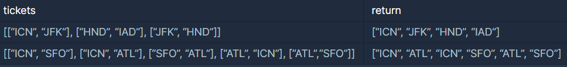

# Programmers_여행경로

### **문제 설명**

주어진 항공권을 모두 이용하여 여행경로를 짜려고 합니다. 항상 ICN 공항에서 출발합니다.

항공권 정보가 담긴 2차원 배열 tickets가 매개변수로 주어질 때, 방문하는 공항 경로를 배열에 담아 return 하도록 solution 함수를 작성해주세요.

### 제한사항

- 모든 공항은 알파벳 대문자 3글자로 이루어집니다.
- 주어진 공항 수는 3개 이상 10,000개 이하입니다.
- tickets의 각 행 [a, b]는 a 공항에서 b 공항으로 가는 항공권이 있다는 의미입니다.
- 주어진 항공권은 모두 사용해야 합니다.
- 만일 가능한 경로가 2개 이상일 경우 알파벳 순서가 앞서는 경로를 return 합니다.
- 모든 도시를 방문할 수 없는 경우는 주어지지 않습니다.

### 입출력 예



### 입출력 예 설명

예제 #1

[ICN, JFK, HND, IAD] 순으로 방문할 수 있습니다.

예제 #2

[ICN, SFO, ATL, ICN, ATL, SFO] 순으로 방문할 수도 있지만 [ICN, ATL, ICN, SFO, ATL, SFO] 가 알파벳 순으로 앞섭니다.

---

### 풀이

주어진 티켓을 모두 사용하여 여행경로를 구하는 문제이다.

- 만일 가능한 경로가 2개 이상일 경우 알파벳 순서가 앞서는 경로를 return 합니다.

위와 같은 문제의 제한사항이 주어진 것을 봤을 때 가능한 경로는 여러개가 나오면 마지막에 정렬 과정이 필요하다는 것을 알 수 있다.

제한 사항에 중복티켓에 대한 언급이 없으므로 중복티켓의 경우도 고려해서 문제를 해결해야 한다.

중복티켓의 예시는 아래와 같다.

ex. tickets = [[ICN, ABC], [ICN, ABC], [ABC, DEF]]

출발지에서 목적지에 관한 정보를 인접행렬 형태로 저장했다.

중복티켓을 고려해야 하므로 인접행렬을 생성할 때 연결여부가 아닌 티켓의 수로 데이터를 저장했다.

```python
for from_a, to_a in tickets:
        idx_from = airports.index(from_a)
        idx_to = airports.index(to_a)
        matrix[idx_from][idx_to] += 1
```

이 문제는 bfs 방식으로 해결했다.

stack에 저장한 데이터 형식은 아래와 같다.

- ('Airport index number', used_ticket, visited)

stack에 데이터를 추가하는 조건은 두 가지가 있다.

1. 인접행렬에 저장된 티켓이 1 이상이다.
2. used_tikcet에 저장된 저장된 티켓이 인접행렬에 저장된 티켓 수보다 작다.

이에 대한 코드는 아래와 같다.

```python
if matrix[from_airport][i] >= 1 and used_ticket.count((from_airport, i)) < matrix[from_airport][i]:
    stack.append((i, used_ticket+[(from_airport, i)], visited+[airports[i]]))
```

경로로 저장되는 조건은 아래와 같다.

- 현재까지 사용한 티켓 수 == 전체 티켓 수

이에 대한 코드는 아래와 같다.

```python
if len(used_ticket) == len(tickets):
    answer_list.append(visited)
    continue
```

경로가 여러 개 나올 수 있으므로 모든 경로들을 리스트 변수에 저장하고 내림 차순 정렬 하여 가장 첫번째 경로를 answer에 저장했다.

**전체 코드**

```python
def solution(tickets):
    answer = []
    answer_list = []
    airports = []
    for from_a, to_a in tickets:
        airports += [from_a, to_a]

    airports = sorted(list(set(airports)))

    matrix = [[0]*len(airports) for _ in range(len(airports))]

    for from_a, to_a in tickets:
        idx_from = airports.index(from_a)
        idx_to = airports.index(to_a)
        matrix[idx_from][idx_to] += 1

    ICN_idx = airports.index('ICN')

    stack = [(ICN_idx, [], ['ICN'])]

    while stack:
        from_airport, used_ticket, visited = stack.pop()

        if len(used_ticket) == len(tickets):
            answer_list.append(visited)
            continue

        for i in range(len(matrix[from_airport])):
            if matrix[from_airport][i] >= 1 and used_ticket.count((from_airport, i)) < matrix[from_airport][i]:
                stack.append((i, used_ticket+[(from_airport, i)], visited+[airports[i]]))

    answer_list.sort()

    answer = answer_list[0]

    return answer
```

---

### 출처

- 문제출처

    [https://programmers.co.kr/learn/courses/30/lessons/43164](https://programmers.co.kr/learn/courses/30/lessons/43164)
