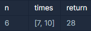

# Programmers_입국심사

### **문제 설명**

n명이 입국심사를 위해 줄을 서서 기다리고 있습니다. 각 입국심사대에 있는 심사관마다 심사하는데 걸리는 시간은 다릅니다.

처음에 모든 심사대는 비어있습니다. 한 심사대에서는 동시에 한 명만 심사를 할 수 있습니다. 가장 앞에 서 있는 사람은 비어 있는 심사대로 가서 심사를 받을 수 있습니다. 하지만 더 빨리 끝나는 심사대가 있으면 기다렸다가 그곳으로 가서 심사를 받을 수도 있습니다.

모든 사람이 심사를 받는데 걸리는 시간을 최소로 하고 싶습니다.

입국심사를 기다리는 사람 수 n, 각 심사관이 한 명을 심사하는데 걸리는 시간이 담긴 배열 times가 매개변수로 주어질 때, 모든 사람이 심사를 받는데 걸리는 시간의 최솟값을 return 하도록 solution 함수를 작성해주세요.

### 제한사항

- 입국심사를 기다리는 사람은 1명 이상 1,000,000,000명 이하입니다.
- 각 심사관이 한 명을 심사하는데 걸리는 시간은 1분 이상 1,000,000,000분 이하입니다.
- 심사관은 1명 이상 100,000명 이하입니다.

### 입출력 예



### 입출력 예 설명

가장 첫 두 사람은 바로 심사를 받으러 갑니다.

7분이 되었을 때, 첫 번째 심사대가 비고 3번째 사람이 심사를 받습니다.

10분이 되었을 때, 두 번째 심사대가 비고 4번째 사람이 심사를 받습니다.

14분이 되었을 때, 첫 번째 심사대가 비고 5번째 사람이 심사를 받습니다.

20분이 되었을 때, 두 번째 심사대가 비지만 6번째 사람이 그곳에서 심사를 받지 않고 1분을 더 기다린 후에 첫 번째 심사대에서 심사를 받으면 28분에 모든 사람의 심사가 끝납니다.

---

### 풀이

이 문제는 이분탐색으로 풀어야 하는 문제다.

하지만 어떤 방식으로 이분탐색을 적용할지 감을 못 잡았고 다른 방법(heap을 이용한 방법)을 택해서 문제를 해결하려 했다.

결과는 시간 초과로 실패했다.

따라서 [다른 사람의 풀이](https://m.post.naver.com/viewer/postView.nhn?volumeNo=27248090&memberNo=33264526)를 참고해서 아이디어를 얻었다.

해결책에 대한 아이디어는 아래와 같다.

- n 명을 심사하는 최소 시간을 구하는 문제로  시간을 기준으로 이분탐색을 진행한다.
- 초기 최솟값(left) : 1
- 초기 최댓값(right) : max(times) * n

    ⇒ 심사 처리가 가장 느린 직원이 모든 손님을 처리하는 시간을 의미한다.

- mid : 식은 다음과 같으며 (left + right) // 2, 현재 탐색하는 범위의 중간 값

    ⇒ mid 값을 각 직원의 처리 시간으로 나누면 mid 시간 동안 각 직원이 처리할 수 있는 손님 수를 구할 수 있다.

- people : 입국 심사를 받은 손님 수

    ⇒ people ≥ n : answer에 mid를 저장하고 mid의 왼쪽 탐색

    ⇒ people < n : mid의 오른쪽 탐색

**전체 코드**

```python
def solution(n, times):
    answer = 0
    left, right = 1, max(times) * n
    people = 0
    
    while left <= right:
        mid = (left + right) // 2
        
        people = 0
        
        for time in times:
            people += mid // time
            
            if people >= n:
                answer = mid
                right = mid-1
                break
                
        if people < n:
            left = mid+1
        
    return answer
```

참고로 힙을 이용한 실패한 코드는 아래와 같다.

- 힙을 이용한 코드

    **이전 풀이**

    ```python
    import heapq

    def solution(n, times):
        answer = 0
        times = sorted(times)
        working = [(time, time) for time in times]
        
        heapq.heapify(working)
        
        while n > 0:
            min_time, i = heapq.heappop(working)
            if min_time + i < working[0][0]:
                j = (working[0][0] - min_time) // i
                n -= (1 + j)
                answer = min_time + i * j
                heapq.heappush(working, (min_time+(i*(j+1)), i))
            else:
                n -= 1
                answer = min_time
                heapq.heappush(working, (min_time+i, i))
        
        return answer
    ```

---

### 출처

- 문제출처

    [https://programmers.co.kr/learn/courses/30/lessons/43238](https://programmers.co.kr/learn/courses/30/lessons/43238)

- 참고출처

    [https://m.post.naver.com/viewer/postView.nhn?volumeNo=27248090&memberNo=33264526](https://m.post.naver.com/viewer/postView.nhn?volumeNo=27248090&memberNo=33264526)