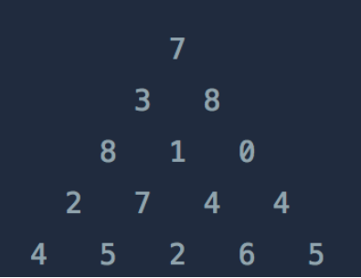

# Programmers_정수 삼각형
### **문제 설명**



위와 같은 삼각형의 꼭대기에서 바닥까지 이어지는 경로 중, 거쳐간 숫자의 합이 가장 큰 경우를 찾아보려고 합니다. 아래 칸으로 이동할 때는 대각선 방향으로 한 칸 오른쪽 또는 왼쪽으로만 이동 가능합니다. 예를 들어 3에서는 그 아래칸의 8 또는 1로만 이동이 가능합니다.

삼각형의 정보가 담긴 배열 triangle이 매개변수로 주어질 때, 거쳐간 숫자의 최댓값을 return 하도록 solution 함수를 완성하세요.

### 제한사항

- 삼각형의 높이는 1 이상 500 이하입니다.
- 삼각형을 이루고 있는 숫자는 0 이상 9,999 이하의 정수입니다.

### 입출력 예

triangle = [[7], [3,8], [8,1,0], [2,7,4,4],[4,5,2,6,5]] : result = 30

---

### 풀이

현재 층 각 칸에 대하여 거쳐간  숫자의 합이 가장 큰 경우를 구하기 위해서는 이전 층의 정보가 필요하다.

따라서 꼭대기 층에서 부터 한 층 씩 내려오면서 각 칸마다 숫자의 합이 가장 큰 경우가 되도록 계산을 수행한 후 리스트 형태로 저장한다.

문제에 대한 해답은 바닥 층까지 계산을 수행 한 후  바닥층 리스트의 값 중 가장 큰 값이다.

```python
def solution(triangle):

    prev_floor = triangle[0]
    cur_floor = []

    for i in range(1, len(triangle)):
        length = len(triangle[i])

        for j in range(length):
            if(j == 0):
                cur_floor = [triangle[i][0]+prev_floor[0]]
            elif(j == length-1):
                cur_floor += [triangle[i][j]+prev_floor[j-1]]
            else:
                cur_floor += [triangle[i][j]+max(prev_floor[j-1], prev_floor[j])]

        prev_floor = cur_floor

    answer = max(cur_floor)

    return answer
```

---

### 출처

- 문제 출처

    [https://programmers.co.kr/learn/courses/30/lessons/43105](https://programmers.co.kr/learn/courses/30/lessons/43105)
