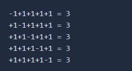

# Programmers_타겟 넘버
### **문제 설명**

n개의 음이 아닌 정수가 있습니다. 이 수를 적절히 더하거나 빼서 타겟 넘버를 만들려고 합니다. 예를 들어 [1, 1, 1, 1, 1]로 숫자 3을 만들려면 다음 다섯 방법을 쓸 수 있습니다.



사용할 수 있는 숫자가 담긴 배열 numbers, 타겟 넘버 target이 매개변수로 주어질 때 숫자를 적절히 더하고 빼서 타겟 넘버를 만드는 방법의 수를 return 하도록 solution 함수를 작성해주세요.

### 제한사항

- 주어지는 숫자의 개수는 2개 이상 20개 이하입니다.
- 각 숫자는 1 이상 50 이하인 자연수입니다.
- 타겟 넘버는 1 이상 1000 이하인 자연수입니다.

### 입출력 예

numbers = [1, 1, 1, 1, 1], target = 3 : return 5

### 입출력 예 설명

문제에 나온 예와 같습니다.

---

### 풀이

numbers에 들어 있는 모든 숫자를 더하고 빼면서 마지막 계산 결과가 target이 되는지 경우의 수를 세는 문제이다.

트리 구조를 연상하면서 dfs 문제라는 것을 알게 됐다.

stack에 (현재까지의 합, 현재까지 계산된 인덱스) 형태로 데이터를 저장하고 push와 pop을 반복하며 마지막 인덱스에 도달 할 때 수의 합이 target과 같으면 answer에 1을 더한다.

```python
def solution(numbers, target):
    answer = 0

    stack = []
    length = len(numbers)

    stack.append((numbers[0], 0))
    stack.append((numbers[0] * -1, 0))

    while stack:
        cur_num, idx = stack.pop()
        if idx == length - 1:
            if cur_num == target:
                answer += 1
            continue

        next_num = numbers[idx + 1]

        stack.append((cur_num + next_num, idx + 1))
        stack.append((cur_num - next_num, idx + 1))

    return answer
```

---

### 출처

- 문제 출처

    [https://programmers.co.kr/learn/courses/30/lessons/43165](https://programmers.co.kr/learn/courses/30/lessons/43165)
