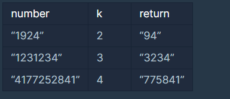

# Programmers_큰 수 만들기

### **문제 설명**

어떤 숫자에서 k개의 수를 제거했을 때 얻을 수 있는 가장 큰 숫자를 구하려 합니다.

예를 들어, 숫자 1924에서 수 두 개를 제거하면 [19, 12, 14, 92, 94, 24] 를 만들 수 있습니다. 이 중 가장 큰 숫자는 94 입니다.

문자열 형식으로 숫자 number와 제거할 수의 개수 k가 solution 함수의 매개변수로 주어집니다. number에서 k 개의 수를 제거했을 때 만들 수 있는 수 중 가장 큰 숫자를 문자열 형태로 return 하도록 solution 함수를 완성하세요.

### 제한 조건

- number는 1자리 이상, 1,000,000자리 이하인 숫자입니다.
- k는 1 이상 `number의 자릿수` 미만인 자연수입니다.

### 입출력 예



---

### 풀이

입력으로 주어지는 number의 앞에서부터 제거할 수인지 확인하면 된다.

제거 여부는 아래와 같이 판단한다.

- 현재 i 번째 수보다 큰 수가 범위(i+1 ~ i+k)에 있으면 i 번째 수는 제거할 숫자가 된다.
- 단, i 번째 수가 9라면 범위(i+1 ~ i+k)를 조사하지 않는다.

    ⇒ 이 조건이 시간을 많이 단축시켜 준다.

숫자 하나를 제거할 때마다 k 값을 1 감소시킨다.

문제를 풀 때는 위의 조건을 반대로 생각해서 조건을 만족하지 않는 수, 즉 제거하지 않을 숫자를 tmp 변수에 저장했다.

k가 0이 되거나 주어진 number에 있는 수를 모두 확인하면 반복을 종료한다.

**전체 코드**

```python
def solution(number, k):
    answer = ''
    length = k
    num_list = str(number)
    tmp = ''
    
    for i in range(len(num_list)):
        flag = 1
        for j in range(1, k+1):
            if num_list[i] == '9':
                break
            elif(num_list[i] < num_list[i+j]):
                flag = 0
                k -= 1
                break
            
        if(flag):
            tmp += num_list[i]
            
        if(len(tmp) == len(number) -length or k == 0):
            break
        
    
    answer = tmp
    if(len(answer) < len(number)-k):
        answer += number[i+1:]
    
    return answer
```

---

### 출처

- 문제출처

    [https://programmers.co.kr/learn/courses/30/lessons/42883](https://programmers.co.kr/learn/courses/30/lessons/42883)